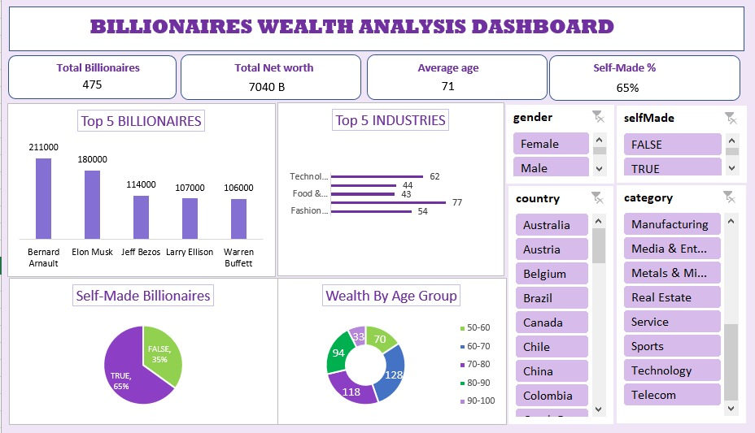

# Billionaires Wealth Analysis Dashboard

## Description
This project is an Excel-based dashboard created to analyze global billionaires data, focusing on wealth distribution, industries, demographics, and self-made status.

## Key Analysis & Insights
- Total number of billionaires and overall net worth
- Top 5 billionaires by net worth
- Industry-wise distribution of billionaires
- Self-made vs inherited wealth comparison
- Wealth distribution across age groups
- Interactive slicers for gender, country, and category

## Tools Used
- Microsoft Excel

## Dashboard Preview

